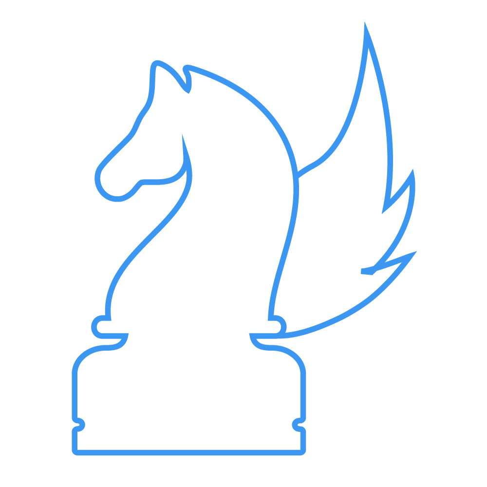

<p align="center">
    <a href="" target="_blank"></a>
</p>

# LightChess
An online chess platform featuring multiple game formats, a matchmaking algorithm, and an integrated rating system where players can compete against each 
other and track their progress through our leaderboards, creating an engaging and rewarding experience for chess enthusiasts.

# Tech Stack
  <p align="center">
    <a href=""></a>
    <a href=""></a>
    <a href=""></a>
    <a href=""></a>
    <a href=""></a>
    <a href=""></a>
    <a href=""></a>
   </p>
   
# Other Dependencies
### Frontend:
- [Material UI](https://mui.com/)
- [axios](https://axios-http.com/)
- [chess.js](https://github.com/jhlywa/chess.js)
- [react-chessboard](https://github.com/Clariity/react-chessboard)
- [react-chartjs-2](https://react-chartjs-2.js.org/)
- [react-apexcharts](https://apexcharts.com/docs/react-charts/)
- [pgn-viewer](https://github.com/mliebelt/PgnViewerJS)

### Backend, Authentication and Database:
- [JWT](https://jwt.io/)
- [passport](https://www.passportjs.org/)

# Features
[INCOMPLETE]

# Development
### clone the repo
```bash
git clone https://github.com/L1ghtweight/lightchess
```

### Set environment variables
#### .env for backend
```conf
ACCESS_TOKEN_SECRET=
REFRESH_TOKEN_SECRET=
DB_URL=
lightchessEmail=
lightchessEmailPass=
GOOGLE_CLIENT_ID=
GOOGLE_CLIENT_SECRET=
DEBUG_MODE=
```


### Start dev servers

```bash
cd frontend
npm install
cd ../backend/
npm install
```

Start both backend and frontend with `npm start`


# Production build

```bash
cd frontend
npm run build
cd ../backend
npm run build
```

now run the build with `npm run production`

# Inspirations
This project was inspired by free/libre, open-source chess server [Lichess.org](lichess.org)
